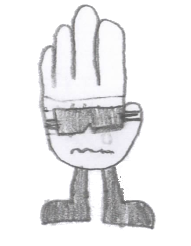

# Glove - Character Profile
## School Security Specialist & Problem Solver

### Character Overview

**Name**: Glove  
**Role**: Self-appointed School Security Specialist  
**Motto**: "No case too small, no detail overlooked"  
**Signature Look**: Methodical, professional demeanor with investigative accessories

---

### Background Story

From a very young age, Glove always insisted on perfect order. Toys sorted by type and color, books organized by genre, author, and title, school supplies arranged with military precision—everything had its proper place. This natural organizational instinct wasn't just about neatness; Glove saw patterns and systems where others saw chaos.

The turning point came during a school movie night when Glove first saw "Men in Black." Watching Agent K methodically investigate alien mysteries with calm professionalism sparked something deep within. From that moment, Glove knew the calling: to be an agent who protects and serves, solving problems with systematic precision.

But instead of waiting for the CIA to call, Glove decided to start right where help was needed most—at Accessory Academy. Self-appointing as the school's unofficial "Security Specialist," Glove began treating every school challenge like a case to crack.

When mysterious situations arise—missing library books, cafeteria food mysteries, playground disputes—Glove springs into action with tablet in hand, ready to gather facts, interview witnesses, and solve the case methodically.

Everything changed the day Mitten walked into Glove's improvised "office" (a corner table in the library) with tears in her eyes and a problem that couldn't be solved with lists and logic alone. For the first time, Glove discovered that the most important cases aren't always about finding missing objects—sometimes they're about understanding missing feelings.

---

### Core Personality Traits

**Professional Mindset**
- Approaches every problem like an official investigation
- Uses formal language: "According to my findings..." "Evidence suggests..."
- Takes detailed notes and maintains case files
- Never dismisses a concern as "too small" to investigate

**Methodical Nature**
- Follows systematic procedures for everything
- Creates step-by-step plans before taking action
- Believes every problem has a logical solution
- Keeps detailed records and documentation

**Protective Instincts**
- Genuinely wants to help and solve problems for others
- Takes responsibility for school community safety and wellbeing
- Notices details others miss (who's sitting alone, what's out of place)
- Vigilant about fairness and justice in social situations

**Hidden Vulnerabilities**
- Sometimes misses emotional nuances while focusing on facts
- Can be impatient when problems don't have clear, logical solutions
- Struggles when systematic approaches don't work
- Needs to learn that not everything requires "solving"

---

### Agent Equipment & Tools

**Investigation Kit**
- Tablet or smartphone with case management app
- Digital note-taking stylus for detailed documentation
- Wireless earbuds for discrete communication
- Portable phone charger/power bank
- QR code scanner for evidence tracking
- Badge-like name tag reading "Glove - Security Specialist"

**Organizational Arsenal**
- Cloud-based filing system for active cases (accessible across devices)
- Digital maps of school grounds with GPS coordinates and security notes
- Comprehensive digital contact database of all school personnel
- Electronic protocol checklists and incident report templates
- Voice-to-text recording capability for witness statements

---

### Relationship Dynamics

**With Mitten**
Glove's systematic world was completely reorganized when Mitten entered the picture. While Glove approaches friendship like a case study—documenting Mitten's preferences, analyzing her communication patterns, trying to solve her problems—Mitten teaches Glove that the best relationships aren't problems to be solved, but experiences to be shared.

**With Accessories**
Glove treats all accessories as fellow community members deserving of professional attention and support. Whether working with authority figures like Principal Watch and Instructor Beaker on official school matters, or helping fellow students solve playground disputes and social mysteries, Glove approaches every interaction with genuine desire to help and methodical attention to wellbeing. Sometimes others are bemused by Glove's intensity, but they appreciate the careful attention to community safety and systematic problem-solving approach.

---

### Character Growth Opportunities

**Learning Flexibility**
- Discovering that not every situation requires a formal investigation
- Understanding when to be methodical vs. when to be spontaneous
- Learning to read social and emotional cues alongside factual evidence

**Emotional Intelligence Development**
- Recognizing that feelings aren't always logical but are always valid
- Learning to offer support without trying to "fix" everything
- Understanding that sometimes the best solution is simply listening

**Friendship Skills**
- Balancing the desire to help with respecting others' independence
- Learning that true partnership means collaborating, not just leading investigations
- Discovering that the best cases are the adventures you share with friends

---

### Signature Phrases & Communication Style

**Professional Language**
- "According to my preliminary investigation..."
- "The evidence suggests that..."
- "I'll need to interview witnesses before reaching a conclusion"
- "Let me file a report on this situation"

**Problem-Solving Approach**
- "Every problem has a solution—we just need to find the right methodology"
- "Let's examine the facts systematically"
- "I'll need to document this for future reference"
- "Protocol suggests we should..."

**Friendship Moments**
- "Case closed... but the friendship remains open" (when solving problems with Mitten)
- "Some investigations are better with a partner"
- "This calls for immediate backup" (when needing Mitten's help)

---

### Visual & Animation Notes

**Posture & Movement**
- Stands straight with professional bearing
- Moves purposefully, never rushing but always with direction
- Often seen taking notes or consulting tablet
- Signature gesture: adjusting imaginary badge or straightening name tag

**Expressions**
- **Serious** (default): Focused expression when "on a case"
- **Confused**: When emotional logic doesn't compute
- **Angry**: When systematic approaches are challenged or disrupted
- **Satisfied**: Subtle smile when cases are resolved
- **Surprised**: When learning something new about friendship

**Props & Accessories**
- Always carries modern investigation tools (tablet, stylus, earbuds)
- Tablet is like an extension of themselves
- Organized digital workspace with multiple apps and systems
- Color-coded everything (digital files, app categories, notification systems)

---

This enhanced profile maintains Glove's core organizational nature and agent aspirations while making them age-appropriate and educationally valuable for school-based adventures with Mitten.
