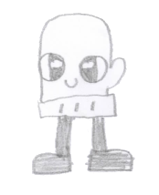

# Mitten - Character Profile
## Social Media Enthusiast & Heart of the Community

### Character Overview

**Name**: Mitten  
**Role**: Social connector and emotional support specialist  
**Motto**: "Every day deserves at least one smile"  
**Signature Look**: Warm, approachable, always ready with encouragement

---

### Background Story

Mitten has always been a free spirit, allowing Fingers and Hand to freely mingle and socialize—this open, welcoming approach has shaped Mitten's entire worldview. Mitten is constantly looking to try new activities, pursue fresh ideas, and hopes to bring at least one smile to every Accessory each day.

Mitten thrives in social situations: days spent exploring, connecting with friends, trying new experiences, and evenings sharing those adventures with followers across social media platforms. With a devoted online community, Mitten genuinely cares about keeping everyone engaged and happy, seeing social media not as self-promotion but as a way to spread joy and connection.

Everything changed on one terrible day when Mitten's social media accounts exploded—but for all the wrong reasons. Fans and subscribers were turning hostile, and scrolling through the comments revealed the devastating cause: a post in big bold letters that read "I'M DONE KEEPING YOU DRONES HAPPY, THIS WILL BE MY LAST POST, GO WASTE YOUR TIME ELSEWHERE, I'M NO LONGER YOUR MUSE!" 

As the shock subsided, Mitten realized the horrible truth—all accounts had been hacked! Someone had deliberately sabotaged everything Mitten had worked to build.

Needing a clear head to think, Mitten decided to escape to the library—a quiet place to process everything that had happened. Overwhelmed by questions: How did this happen? Who would want to hurt me? How can I fix this? Will I lose everything I've built? While searching for a secluded spot to sit and think, Mitten spotted a handwritten sign on a corner table: "Any Case Welcome - Glove, Security Specialist."

With no other options, a distraught Mitten approached Glove's improvised "office" at the library table, not knowing this moment would transform both their lives forever.

---

### Core Personality Traits

**Social Connector**
- Naturally draws people together and builds community
- Sees the best in everyone and helps others see it too
- Intuitive about social dynamics and emotional needs
- Believes in the power of shared experiences and authentic connection

**Optimistic Spirit**
- Approaches challenges with hope and creativity
- Finds silver linings and alternative perspectives
- Resilient in the face of setbacks, but not immune to deep hurt
- Spreads positivity without toxic positivity—acknowledges real struggles

**Authentic Communicator**
- Speaks from the heart, sometimes without filtering
- Uses social media to genuinely connect, not just for attention
- Values honest relationships over perfect presentations
- Sometimes overshares in effort to be authentic and helpful

**Hidden Vulnerabilities**
- Deeply affected by criticism and negative feedback
- Sometimes sacrifices own needs to make others happy
- Can be impulsive when emotions run high
- Struggles with technical/systematic approaches that Glove excels at

---

### Social Media & Technology

**Platform Approach**
- Uses social media as a tool for community building and spreading joy
- Shares authentic moments, learning experiences, and encouragement
- Engages meaningfully with followers, remembering details about their lives
- Creates content that brings people together rather than dividing them

**Communication Style**
- Warm, encouraging language with lots of emojis and enthusiasm
- Asks questions to engage others and show genuine interest
- Shares vulnerabilities to help others feel less alone
- Celebrates others' achievements and milestones

---

### Relationship Dynamics

**With Glove**
Mitten's emotional, intuitive approach initially confuses Glove's systematic worldview, but their friendship becomes a perfect complement. While Glove tries to "solve" Mitten's problems with logic and investigation, Mitten teaches Glove that some of life's most important elements—feelings, creativity, spontaneous joy—can't be documented in case files. Mitten appreciates Glove's protection and methodical support, while bringing warmth and emotional intelligence to Glove's sometimes rigid world.

**With Accessories**
Mitten approaches all accessories with genuine warmth and interest, often remembering personal details about their lives and asking thoughtful follow-up questions. Whether connecting with authority figures like Principal Watch and Instructor Beaker, or fellow students throughout the school, Mitten's authentic care and positive energy helps build community. Mitten's social media presence often highlights others' accomplishments and positive moments, making everyone feel seen and valued.

---

### Character Growth Opportunities

**Building Boundaries**
- Learning to protect own emotional well-being while helping others
- Understanding that you can't make everyone happy all the time
- Developing skills to recognize and respond to toxic behavior online and offline

**Resilience Development**
- Building confidence that doesn't depend on external validation
- Learning to process criticism constructively without being devastated
- Developing internal compass for self-worth beyond social media metrics

**Collaboration Skills**
- Learning to appreciate different approaches (like Glove's methodical style)
- Understanding when situations call for logic vs. emotion
- Discovering that the best solutions often combine heart and mind

---

### Signature Phrases & Communication Style

**Social Media Voice**
- "Hope everyone's having an amazing day! ✨"
- "Just had to share this beautiful moment..."
- "Sending love to anyone who needs it today! 💕"
- "Who else is excited about [shared experience]?"

**Problem-Solving Approach**
- "How are you feeling about this?"
- "What if we tried looking at it this way?"
- "I believe in us—we'll figure this out together"
- "Sometimes the best solutions come from the heart"

**Friendship Moments**
- "You always know just what to investigate, Glove!"
- "We make a pretty great team, don't we?"
- "Thank you for always having my back"

---

### Visual & Animation Notes

**Posture & Movement**
- Naturally open and welcoming body language
- Moves with energy and enthusiasm, sometimes bouncing when excited
- Often gestures while talking, very expressive with whole body
- Comfortable in personal space, naturally affectionate

**Expressions**
- **Happy** (default): Warm, genuine smile that lights up surroundings
- **Sad**: Deep, emotional expression that shows vulnerability
- **Surprised**: Wide-eyed wonder and excitement
- **Angry**: Rare but intense when values like kindness are violated
- **Sleepy**: Cozy, content expression often seen during quiet moments

**Props & Accessories**
- Smartphone always nearby for capturing and sharing moments
- Various accessories that change based on activities and moods
- Often carries small items that remind them of friends (photos, gifts, notes)
- Colorful, warm accessories that reflect personality

---

This profile balances Mitten's social media savvy with genuine emotional intelligence, creating a character who uses technology to build authentic connections rather than seek empty validation.
